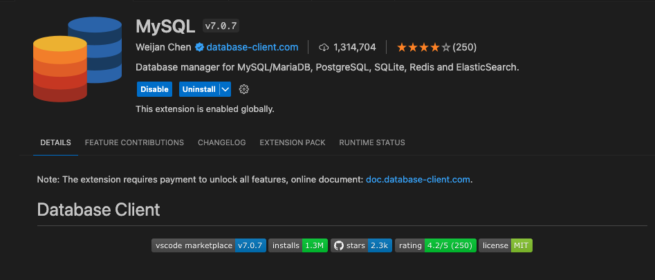
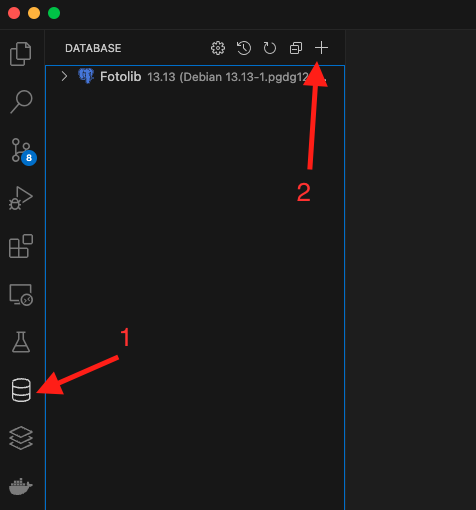
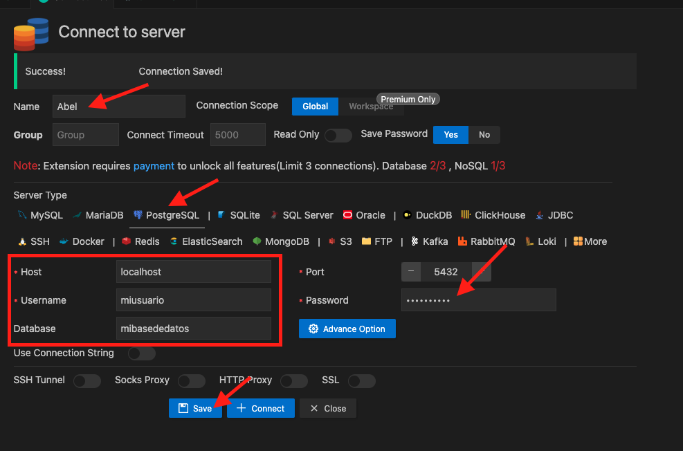
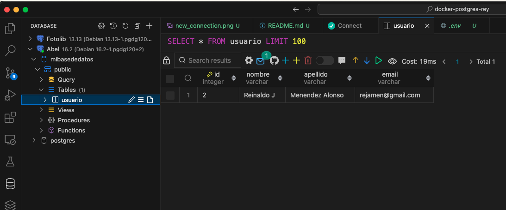

# fastapi + PostgreSQL + Docker

En este proyecto se ha creado un CRUD utilizando FastAPI como backend, PostgreSQL como gestor de base de datos y Docker para ejecutar todo el entorno.

## Conectando múltiples servicios en Docker
Cuando desarrollamos alguna solución en Docker, una alternativa sería ejecutar los contenedores de manera independiente pero no es la más cómoda (opinión del que escribe este README 😊)

Si fuéramos a hacerlo de esta forma deberíamos seguir estos pasos.

1. Ejecutar el comando para correr el contenedor de PostgreSQL
```
docker run -d --name db \
  -e POSTGRES_USER=miusuario \
  -e POSTGRES_PASSWORD=mipassword \
  -e POSTGRES_DB=mibasededatos \
  postgres:latest
```
* Esto creará un contendeor de PostgreSQL, llamado `db` con un usuario llamado `miusuario`, password `mipassword` y una base de datos llamada `mibasededatos`

2. Después de que el contenedor de PostgreSQL esté listo (pudiera tardar unos minutos), necesitamos saber la dirección IP que se le ha asigando al mismo ejecutando el siguiente comando
```
postgres_ip=$(docker inspect -f '{{range .NetworkSettings.Networks}}{{.IPAddress}}{{end}}' db)

```
* Este comando almacena la dirección IP en la variable `postgres_ip`

* En este comando, al final se le especifica el nombre del contenedor (`db` en este caso) del cual se desea saber la dirección IP. Tenga en cuenta, que Docker gestiona la red de una manera particular y mágica y no siempre tenemos que entenderlo (opinión del que escribe 😊)

3. Por último, debemos ejecutar el comando para crear el contenedor de fastapi y conectarlo al contenedor de PostgreSQL
```
docker run -d --name app \
  -e POSTGRES_HOST=$postgres_ip \
  -e POSTGRES_PORT=5432 \
  -e POSTGRES_USER=miusuario \
  -e POSTGRES_PASSWORD=mipassword \
  -e POSTGRES_DB=mibasededatos \
  -p 80:80 \
  app:latest
```
* En este comando hay algunas cosas perdidas, pero que no describiremos ya que esta sección es solo para dar una idea de lo que se pudiera hacer. Siga leyendo, y si ha venido probando algo hasta este punto y no ha funcionado culpe a ChatGPT porque el que escribe esto jamás ha hecho ninguno de estos pasos 🚀 😎

## Conectando varios servicios usando docker-compose
La manera que aconsejable sería usando docker-compose. Según la explicación de ChatGPT y su interesante analogía:

Docker Compose es como un "maestro de ceremonias" para aplicaciones que se ejecutan en contenedores. Imagina que estás organizando una fiesta y necesitas varios elementos: música, luces, comida, etc. Con Docker Compose, puedes describir todos estos elementos en un solo "menú" (archivo YAML) y luego decirle a Docker que siga ese menú para configurar y ejecutar todos los servicios necesarios automáticamente. Simplifica la gestión de aplicaciones, permitiendo a las personas que no conocen Docker fácilmente tener una fiesta (o aplicación) funcionando sin lidiar con detalles técnicos complicados.

Basado en esto, necesitamos crear un fichero donde se describa nuestra aplicación. No olvidar nunca, que nuestra aplicación tiene que entenderse como el conjunto de dos contenedores conectados entre sí. No podemos desligarlos y decir que la App es solo fastapi, o solo PostgreSQL.

### Creando el fichero docker-compose
Ahora puede seguir estos pasos, y si algo no funciona, entonces SÍ culpe al que escribió esta documentación 😅

En la ruta principal de tu projecto, crea un fichero llamado `docker-compose.yml` con la siguiente estructura
```yaml
version: '3.8'

services:
  app:
    build:
      context: .
      dockerfile: Dockerfile
    ports:
      - 8000:8000
    volumes:
      - .:/Proyecto_docker1
    depends_on:
      - db

  db:
    image: postgres:latest
    environment:
      POSTGRES_USER: ${POSTGRES_USER}
      POSTGRES_PASSWORD: ${POSTGRES_PASSWORD}
      POSTGRES_DB: ${POSTGRES_DB}
    volumes:
      - postgres_data:/var/lib/postgresql/data
    ports:
      - "5432:5432"

volumes:
  postgres_data:

```

Vamos a explicar paso a paso lo que cada una de estas líneas significa

`version: '3.8'`
* Es la versión de docker-compose se que está usando. Considere que docker-compose es una herramienta asociada a Docker, y como tal tiene varias versiones. Usar la versión 3.8 debería ser suficiente. La versión de docker-compose esta asociada también al engine de Docker que se utilice. Tenga esto en cuanta, en caso de que el engine de Docker que tiene instalado no soporte la versión especificada en el docker-compose. Más información aquí: [Docker compose verioning](https://docs.docker.com/compose/compose-file/compose-versioning/)

`services`
* Básicamente esta línea indica que a continuación se describirán los servicios contenidos en el docker-compose. Importante notar que las próximas líneas todas tienen un nivel de indentación más a la derecha; o sea, están contenidas en la sección services

```yaml
app:
    build:
      context: .
      dockerfile: Dockerfile
    ports:
      - 8000:8000
    volumes:
      - .:/Proyecto_docker1
    depends_on:
      - db
```
* Este es el primer contendor, el de la App web, el de fastAPI.

* Tiene internamente 4 secciones: `build`, `ports`, `volumes` y `depends_on`
    * La sección `build` especifica ¿cómo se construirá este contenedor? En este caso le estamos diciendo que use como `context` . (es decir la ruta donde esta almacenado el docker-file) y que el `dockerfile` a usar es Dockerfile. Esto buscará en la ruta principal del proyecto un fichero Dockerfile y construirá la imagen a partir de lo que haya en ese fichero.
    
    * La sección `ports` indica los puertos que se van a exponer en nuestro contenedor, y está escrito siguiendo el patrón <puerto_en_navegador_local>:<puerto_del_contenedor>. Lo que se está diciendo aquí es "cuando el usuario escriba la URL xxxxxx:8000" conéctate al puerto 8000 dentro de este contenedor. No especifico nada en la URL porque lo que importa en este punto es a que puerto nos estamos conectando.
    
    * La sección `volumes` se usa para 'conectar' carpetas locales (en la PC donde estamos trabajando) con carpetas dentro del contenedor. Entienda que estará escribiendo código en su PC, y queremos que ese código (carpetas, ficheros, etc) estén copiados dentro del contenedor. Básicamente estamos diciendo aquí: todo lo que esta en esta carpeta (gracias al `.:`) copialo para dentro del contenedor, en la ruta `/Proyecto_docker1`. Este último nombre no es arbitrario, y está relacionado con lo que se escribió en el Dockerfile; pues en ese fichero se creó esa carpeta. Revise el Dockerfile si desea entender mejor.

    * La sección `depends_on` es la que realiza la 'magia' de conectar ambos contenedores. Se le está diciendo que el contenedor `app` dependerá del contenedor `db`

* La próxima sección dentro de `services` es la que describe al contenedor de PostgreSQL y este es más simple

```yaml
db:
    image: postgres:latest
    environment:
      POSTGRES_USER: ${POSTGRES_USER}
      POSTGRES_PASSWORD: ${POSTGRES_PASSWORD}
      POSTGRES_DB: ${POSTGRES_DB}
    volumes:
      - postgres_data:/var/lib/postgresql/data
    ports:
      - "5432:5432"
```
* Tiene 4 secciones: `image`, `environment`, `volumes` y `ports`
    * `image` especifica qué imagen se está usando. En este caso, como podemos usar la imagen oficial de postgres sin ninguna modificación podemos escribir directamente `image: postgres:latest`; a diferencia del contenedor anterior que teniamos que construir la imagen a partir de un Docker file. Es decir, tenga en cuenta que tenemos dos opciones: image: <image_name> si podemos usar una imagen previamente creada y que no tenemos que modificar o build (con su context y su Dockerfile) si necesitamos construir la imagen a partir de un Dockerfile

    * `environment` especifica las variable de entorno que se usarán en este contenedor. Para PostgreSQL necesitamos especificar al menos `POSTGRES_USER`, `POSTGRES_PASSWORD` y `POSTGRES_DB`. Luego, en nuestra app de fastapi podremos referirnos a ellas mediante esos nombre (más detalles luego). IMPORTANTE: NO es buena práctica, y NO es aconsejable almacenar los valores en texto plano aquí en el docker-compose, ya que este fichero se va a incluir en un repositorio, y estaríamos exponiendo las credenciales de nuestra aplicación. Por eso, La solución sería crear un fichero `.env`, el cual se incluye dentro del fichero `.gitignore` y nunca se haría commit del mismo, de ese modo esas credenciales no se comparten. Entonces aqui nos referimos no a los valores sino a los nombres de las variables en el fichero .env (este fichero lo crearemos más adelante)

    * `volumes` similar al anterior servicio, solo que esta vez al crear volumenes para PostgreSQL es de esta forma, y esta relacionado con la última línea del docker-compose. Honestamente nunca me he dedicado a intentar cambiarlo 😊

* La última sección del docker-compose es la siguiente, y no es más que la definicón volumenes generales (no hay mucho que decir aqui), y esta relacionado con la forma en la que describimos el volumen de `db`. Importante respetar la indentación (esta sección está al mismo nivel que `services`)
```yaml
volumes:
  postgres_data:
```

## Ejecutando los servicios descritos en el docker-compose

Ahora toca el turno de ejecutar nuestra App (de nuevo, ver la App como la interconexión de dos contenedores corriendo al mismo tiempo)

Primero, estemos seguros de lo siguiente (para que si algo está roto no me culpen a mí 😊)

* docker compose está instalado en nuestra PC: esto es muy importante, y tal vez debio mencionarse desde el inicio. Estemos seguros de que docker compose está instalado. Si estan usando algun cliente como Docker Desktop deberia estar instalado. Pudiera comprobarlo usando el comando `docker-compose --version`

* Tenemos un fichero Dockerfile en la misma ruta en la que se encuentra el fichero docker-compose.yml con el siguiente contenido.

```dockerfile
# Usa la imagen base de Python 3.11
FROM python:3.11

# Establece el directorio de trabajo en /Proyecto_docker1
WORKDIR /Proyecto_docker1

# Copia el archivo de requisitos al contenedor
COPY requirements.txt /Proyecto_docker1

# Instala las dependencias desde el archivo requirements.txt
RUN pip install --no-cache-dir -r /Proyecto_docker1/requirements.txt

# Copia el código fuente de tu aplicación al contenedor
COPY . .

# Expone el puerto 8000 para FastAPI
EXPOSE 8000

# Comando por defecto para ejecutar la aplicación cuando el contenedor se inicie
CMD ["uvicorn", "main:app", "--host", "0.0.0.0", "--port", "8000", "--reload"]
```

* Tenemos un fichero `requirements.txt` en la misma ruta donde se encuentra el docker-compose.yml con el siguiente contenido
```
fastapi
uvicorn
sqlalchemy
pandas
starlette
itsdangerous
jinja2
psycopg2
python-dotenv
```

* Tenemos el fichero `.env` en la misma ruta del docker-compose.yml con el siguiente contenido. Los valores 'miusuario', 'mipassword' y 'mibasededatos' son las credenciales que necesitarías si te deseas conectar a tu base de datos desde otro cliente como PGAdmin, o alguna extensión de VSCode que te permite conectarte a bases de datos. 
```
POSTGRES_USER=miusuario
POSTGRES_PASSWORD=mipassword
POSTGRES_DB=mibasededatos
```

* Tenemos el fichero `main.py` en la misma ruta donde se encuentra el fichero docker-compose.yml con el siguiente contenido (este por ahora, ya luego le agregaremos mas detalles para la conexión con la base de datos)

```python
from fastapi import FastAPI

app = FastAPI()
@app.get('/')
def home():
    return {"message":"Hello World"}
```

Ahora ejecutemos el comando 
```
docker compose up
```
En este punto se construirá la imagen `app` con los datos especificados en el fichero Dockerfile, y se descargará la imagen de postgres para construir el contenedor `db`. Esto puede tardar un poco dependiendo de su conexión a Internet

Cuando vean en consola este resultado entonces deberá ser capaz de ver su aplicación de fastapi corriendo en http://localhost:8000 y ahora sí culparme si no funciona 😊

```
e=0.001 s; distance=0 kB, estimate=0 kB; lsn=0/1954560, redo lsn=0/1954560
db-1   | 2024-03-02 05:58:41.573 UTC [1] LOG:  database system is ready to accept connections
app-1  | INFO:     Started server process [1]
app-1  | INFO:     Waiting for application startup.
app-1  | INFO:     Application startup complete.
app-1  | INFO:     Uvicorn running on http://0.0.0.0:8000 (Press CTRL+C to quit)
```

## Comprobar que ambos contenedores están corriendo

La manera más rápida sería ejecutar el comando `docker ps` y debería ver algo como esto
| CONTAINER ID  | IMAGE                     | COMMAND                   | CREATED          | STATUS         | PORTS                      | NAMES                       |
|---------------|---------------------------|---------------------------|------------------|----------------|----------------------------|-----------------------------|
| b648b20500b1  | docker-postgres-rey-app  | "uvicorn main:app --…"   | 3 minutes ago    | Up 3 minutes   | 0.0.0.0:8000->8000/tcp     | docker-postgres-rey-app-1   |
| e5a5d4ba36d6  | postgres:latest           | "docker-entrypoint.s…"   | 54 minutes ago   | Up 3 minutes   | 5432/tcp                   | docker-postgres-rey-db-1    |

En este resultado se puede ver que tenemos dos contenedores corriendo, la imagen que usa cada uno, el comando que esta ejecutando, cuando se crearon y el estado

## Detener/Iniciar ambos contenedores

Si ambos contenedores están corriendo, su consola habrá quedado 'atrapada' y lo que debe hacer para detenerlos es `Ctrl + C`. Luego, si desea iniciarlos de nuevo pues vuelve a ejecutar `docker compose up`

## docker compose up vs docker-compose up

Para ejecutar los contenedores es posible usar también `docker-compose up` con un guión separando ambas palabras. Esta era la manera antigua de hacerlo, la verdad no tengo mucho que decir aquí.


## Agregar lógica de Postgress en nuestra app fastapi
Vamos a modificar nuestro código de la siguiente forma para establecer una conexión con el contenedor de PostgreSQL, crear una tabla `usuario` y crear varios endpoints para hacer un CRUD de usuarios.

```python
import os
import logging
from dotenv import load_dotenv

from fastapi import FastAPI
from sqlalchemy import create_engine, Column, Integer, String, MetaData
from sqlalchemy.orm import declarative_base, sessionmaker

# Usando logging para mostrar mensajes en la consola.
# Todos amamos print('XXXXX') pero logging es la manera correcta/profesional
# de hacerlo :)
logging.basicConfig(level=logging.INFO)
_logger = logging.getLogger(__name__)

# Leyendo las variables de entorno desde el archivo el environment,
# lo cual es aconsejable para no exponer información sensible.
load_dotenv()
POSTGRES_USER = os.getenv("POSTGRES_USER")
POSTGRES_PASSWORD = os.getenv("POSTGRES_PASSWORD")
POSTGRES_DB = os.getenv("POSTGRES_DB")

# logueando las variables de entorno para estar seguros de que
# se leyeron correctamente. No haga esto en producción,
# es solo una medida para estar seguros de que tenemos los datos
# necesarios para conectarnos a la base de datos.
_logger.info(f"... POSTGRES_USER: {POSTGRES_USER}")
_logger.info(f"... POSTGRES_PASSWORD: {POSTGRES_PASSWORD}")
_logger.info(f"... POSTGRES_DB: {POSTGRES_DB}")

DATABASE_URL = f"postgresql://{POSTGRES_USER}:{POSTGRES_PASSWORD}@db:5432/{POSTGRES_DB}"

_logger.info(f"... DATABASE_URL: {DATABASE_URL}")

# Creando la conexión a la base de datos
engine = create_engine(DATABASE_URL)

# Definición de la tabla 'usuario'.
metadata = MetaData()
Base = declarative_base()

class Usuario(Base):
    __tablename__ = "usuario"
    id = Column(Integer, primary_key=True, index=True)
    nombre = Column(String, index=True)
    apellido = Column(String, index=True)
    email = Column(String, index=True)

Base.metadata.create_all(bind=engine)

# Configuración de la sesión de la base de datos
SessionLocal = sessionmaker(autocommit=False, autoflush=False, bind=engine)

# Configuración de la aplicación FastAPI
app = FastAPI()

# Endpoint para agregar usuario
@app.post("/agregar-usuario/")
async def agregar_usuario(nombre: str, apellido: str, email: str):
    db = SessionLocal()
    usuario = Usuario(nombre=nombre, apellido=apellido, email=email)
    db.add(usuario)
    db.commit()
    db.refresh(usuario)
    db.close()
    return {"message": "Usuario agregado correctamente"}

# Endpoint para obtener todos los usuarios
@app.get("/usuarios/")
async def obtener_usuarios():
    db = SessionLocal()
    usuarios = db.query(Usuario).all()
    db.close()
    return usuarios

# Endponit para obtener un usuario por su email
@app.get("/usuario/{email}")
async def obtener_usuario(email: str):
    db = SessionLocal()
    usuario = db.query(Usuario).filter(Usuario.email == email).first()
    db.close()
    return usuario

# Endpoint para eliminar un usuario por su email
@app.delete("/usuario/{email}")
async def eliminar_usuario(email: str):
    db = SessionLocal()
    usuario = db.query(Usuario).filter(Usuario.email == email).first()
    db.delete(usuario)
    db.commit()
    db.close()
    return {"message": "Usuario eliminado correctamente"}

# Endpoint para actualizar un usuario por su email
@app.put("/usuario/{email}")
async def actualizar_usuario(email: str, nombre: str, apellido: str):
    db = SessionLocal()
    usuario = db.query(Usuario).filter(Usuario.email == email).first()
    usuario.nombre = nombre
    usuario.apellido = apellido
    db.commit()
    db.close()
    return {"message": "Usuario actualizado correctamente"}
```

## Probando nuestra App
Al acceder a http://localhost:800/docs podrá probar cada uno de los endpoints definidos y crear/editar/listar/eliminar usuarios. 

## Una sugerencia final
En mi caso particular, he encontrado un plugin de VSCode que me encanta, pues puedo conectarme a mi Base de Datos desde el mismo VSCode y comprobar que mis datos se estan guardando correctamente sin tener que instalar nada extra. 

* Instala el pluggin MySQL



* Configura una nueva conexión



* Selecciona PostgreSQL en las pestañas de bases de datos soportadas y agrega los datos de tu conexión
  * Name: cualquier nombre que quieras para esta conexión
  * Host: localhost
  * Username / Password / Database: Usa los mismos valores que agregaste en el fichero `.env`



* Comprueba los datos en tu BD
  * Fijate en el espacio donde pone SLECT * FROM usuario LIMIT 100. Ahí puedes ejecutar SQL queries para leer tus datos, o puedes seleccionar celdas y eliminarlas, etc. 




